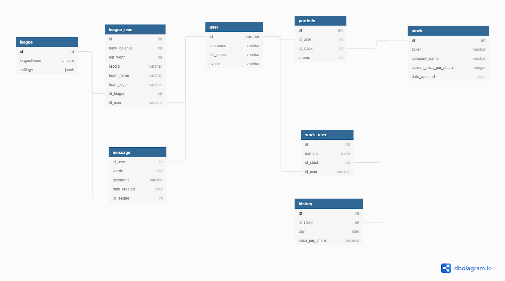

# Folio

Folio is a fantasy stock-trading application. Designed to be played with friends and lower the barrier to entry in traditional stock markets.

## Tech Stack:
  React Redux PostgreSQL Express Node Passport Axios Mocha Travis Husky

# Installation & Setup

1. Fork and clone the repo locally
2. Ensure you're operating node V.12 or greater ( you can check this with the command < node --v>) ( you can update with the ocmmand < nvm use stable >)
3. run < npm install >
## Environment Variables
4. Establish an .env file with the following keys:

GOOGLE_CLIENT_ID=
GOOGLE_CLIENT_SECRET=
DB_USERNAME=
DB_HOST=
DB_DBNAME=
DB_PASSWORD=
DB_PORT=
SERVER_PORT=
IEX_API_KEY:
IEX_API_SANDBOX:
PUSHER_ID=
PUSHER_KEY=
PUSHER_SECRET=
CLUSTER=
NEWS_API_KEY=

### DB Setup

First, install PostgreSQL 12 on your machine:
https://www.postgresql.org/download/

- Then, use `node -v` to check your current version of Node. Upgrade to 12, if not currently on version 12.

- service postgresql start ***start postgresSQL***

- psql -U root ***log in to postgreSQL with your password***

CREATE DATABASE

- stock  ***create postgreSQL database***

- \c stock ***connect to stock database***

- npm run start ***starts development server***

- npm run test-db ***tests database commands and populates w/ sample data***

### Environment Variables for DB

Place in a .env file in outermost directory

- DB_USERNAME ***PostgreSQL login username***

- DB_PASSWORD ***PostgreSQL password***

- DB_HOST ***database host (default=localhost)***

- DB_PORT ***database port (default=5432)***

- DB_DBNAME ***database name (default=stock)***
### Google Keys
To setup your Google Client ID & Google Client Secret run through the steps on the google dev console and enable google+ : https://console.developers.google.com/

## News Keys
To setup your News keys go to https://newsapi.org 

## IEX Stocks
You can sign up for IEX services at https://iexcloud.io
We recommend using sandbox mode until you're ready to deploy in order to conserve your API calls.

## Pusher
You can setup your Pusher keys at https://pusher.com
Make sure you select react for the front end and node for the back end when prompted.

## Running the application

You can start the server by running < npm start > in the terminal
You can start the client by running < npm run dev >
Access the program through localhost:port in a web brouser.

## Deployment

# Schema

## Contact
Scott Anderson > scott.anderson1130@gmail.com
Jose Rodriguez > josesrodriguez610@gmail.com
Christopher Stumpe > toph.stumpe@gmail.com